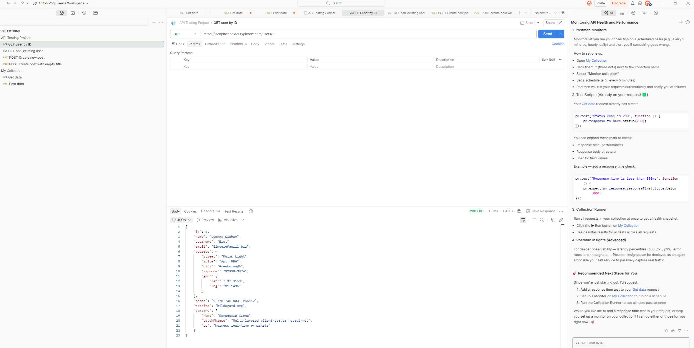

# API Testing Project

This project demonstrates basic API testing skills using a public REST API.

API tested:
https://jsonplaceholder.typicode.com

## Tools Used

- Postman
- REST API
- HTTP requests
- JSON

## Test Coverage

The following endpoints were tested:

GET /users/1  
GET /users/999  
POST /posts

Testing included:

- Positive testing
- Negative testing
- Response structure validation
- HTTP status code verification

## Project Structure

api-test-scenarios.md – API testing scenarios

test-cases.md – detailed test cases

bug-reports.md – example bug reports

postman_collection.json – exported Postman collection with API requests

## Example Request

GET /users/1

Expected result:

- Status code: 200 OK
- Response contains user data in JSON format

## Purpose of the Project

The goal of this project is to demonstrate practical skills in:

- API testing
- writing test cases
- reporting bugs
- working with Postman

- ## Example API Request

Example of API testing using Postman.

